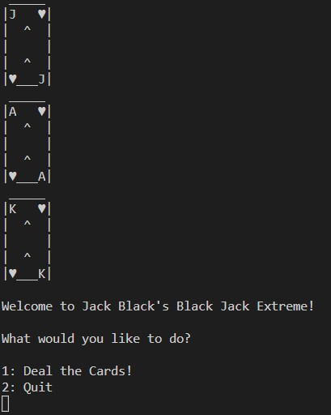
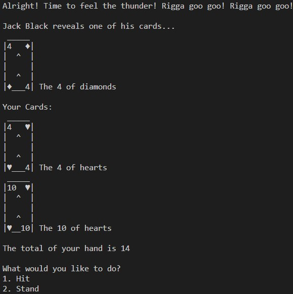

# Jack Black's Black Jack Extreme!

## Terminal app made with javascript

 

### By Clinton Forster

#### To install and run

1. Git clone the repository
2. [Make sure Node Js is installed](https://nodejs.org/en/download/) 
3. Make sure [readline sync](https://www.npmjs.com/package/readline-sync) is installed: 
```
npm i readline-sync
```
4. open folder and run app:
```
 node jackblackblackjack.js 
 ```
5. Playing is easy by simply pressing 1 or 2 from the options and enter.
#### intro screen



#### Gameplay example


 ### Purpose
 Made as practice in class at Coder Academy in one day after one week of learning Javascript. The game is Black Jack and the Dealer is Jack Black.

